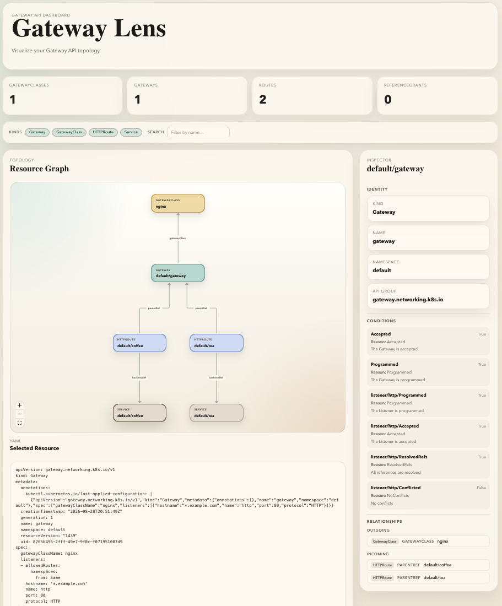

# Gateway Lens Dashboard

The dashboard is a single-page React application that visualizes Kubernetes
[Gateway API](https://gateway-api.sigs.k8s.io/) resources as an interactive
topology graph. It is compiled into the Go binary at build time and served
automatically when `gateway-lens` starts.



## Tech Stack

| Layer           | Technology                                           |
| --------------- | ---------------------------------------------------- |
| UI framework    | [React 19](https://react.dev/) + TypeScript          |
| Graph rendering | [@xyflow/react](https://reactflow.dev/) (React Flow) |
| Graph layout    | [dagre](https://github.com/dagrejs/dagre)            |
| Build tool      | [Vite](https://vite.dev/)                            |
| Linting         | ESLint with typescript-eslint (type-aware rules)      |

## How It Works

1. The dashboard connects to the Go backend's `/events` SSE endpoint and
   fetches topology data from `/data` whenever the backend signals a change.
2. The response is a JSON payload containing **nodes** (Gateway API resources),
   **edges** (relationships between them), **conditions** (resource status), and
   **annotations** (policy metadata).
3. Dagre computes an automatic top-to-bottom layout, and React Flow renders the
   graph with pan, zoom, and selection.
4. Clicking a node opens the **Inspector** sidebar showing the resource's
   identity, attributes, relationships, conditions, annotations, and raw YAML
   manifest.

## Development

### Prerequisites

- [Node.js](https://nodejs.org/) (LTS recommended)

Dependencies are installed automatically by `make dashboard-build`. For manual
installation, run `npm ci` in this directory.

### Dev Server

```sh
VITE_API_BASE_URL=http://localhost:8080 npm run dev
```

This starts the Vite dev server with hot module replacement. Set
`VITE_API_BASE_URL` to point at a running `gateway-lens` process so the
dashboard can fetch live topology data. Without it, the dashboard will attempt
to reach `/data` on its own origin.

### Lint

```sh
npm run lint
```

Or from the repository root:

```sh
make dashboard-lint
```

### Build

```sh
npm run build
```

Or from the repository root:

```sh
make dashboard-build
```

The Vite build outputs compiled assets to `../../internal/app/dashboardui/dist`,
which is embedded into the Go binary via `go:embed`. You do **not** need to
commit the `dist` directory; it is generated during `make build`.

## Data Contract

The dashboard expects the `/data` endpoint to return JSON matching the
`DashboardPayload` type in [`src/types.ts`](src/types.ts):

```typescript
type DashboardPayload = {
  generatedAt: string
  nodes: DashboardNode[]
  edges: DashboardEdge[]
  annotations?: DashboardAnnotation[]
}
```

Each **node** carries a resource reference, key-value attributes, Gateway API
conditions, and an optional YAML manifest. Each **edge** describes a
directional relationship (e.g. `parentRef`, `gatewayClass`, `backendRef`).
